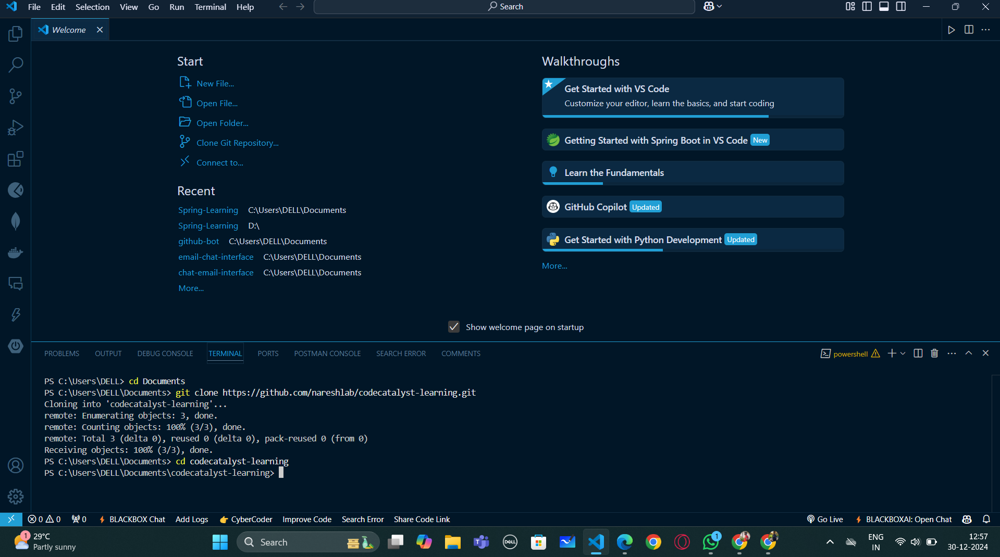
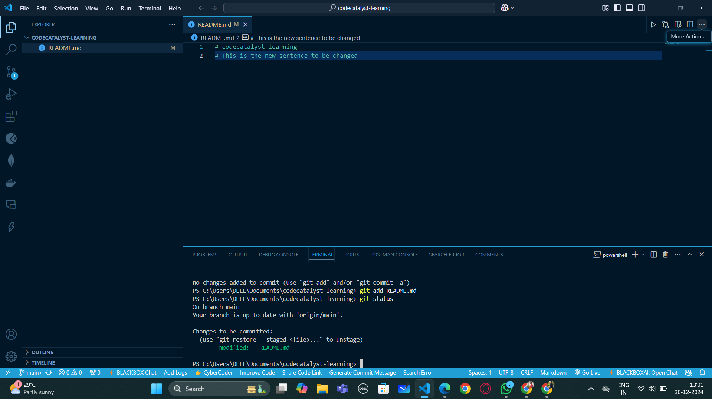
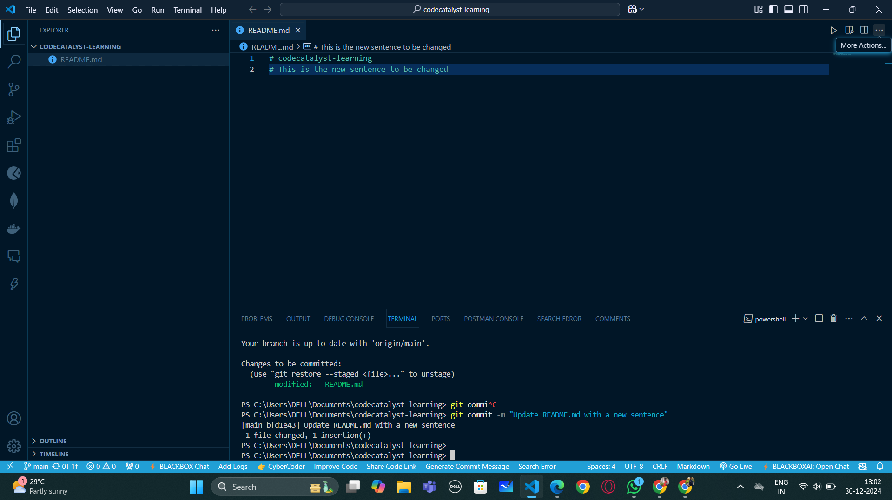
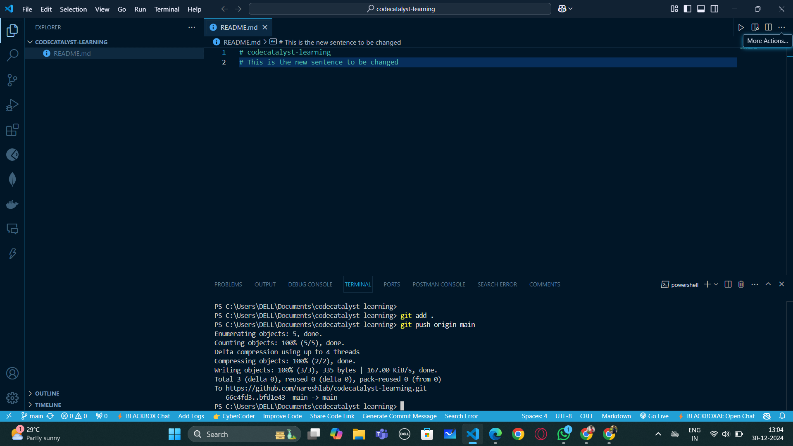
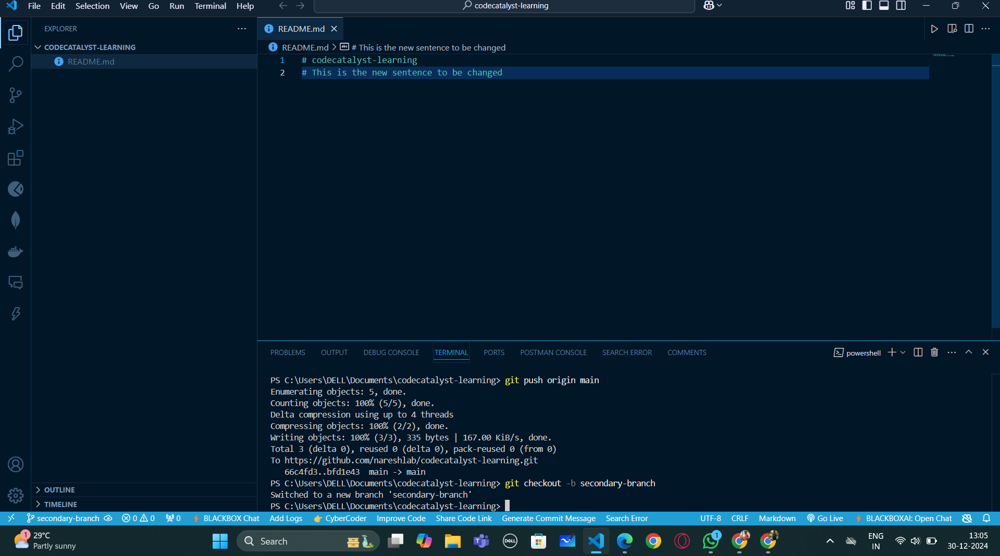
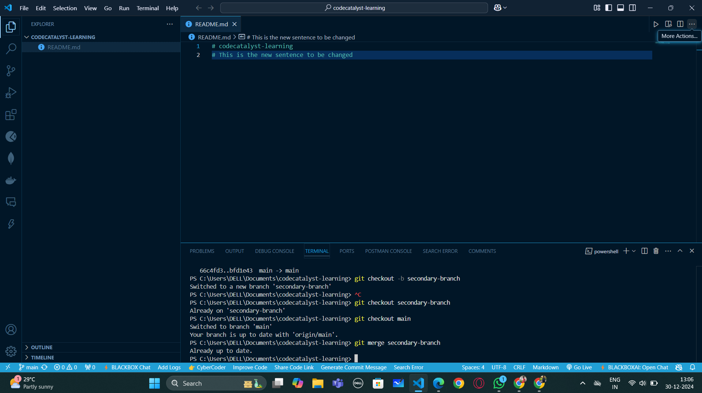
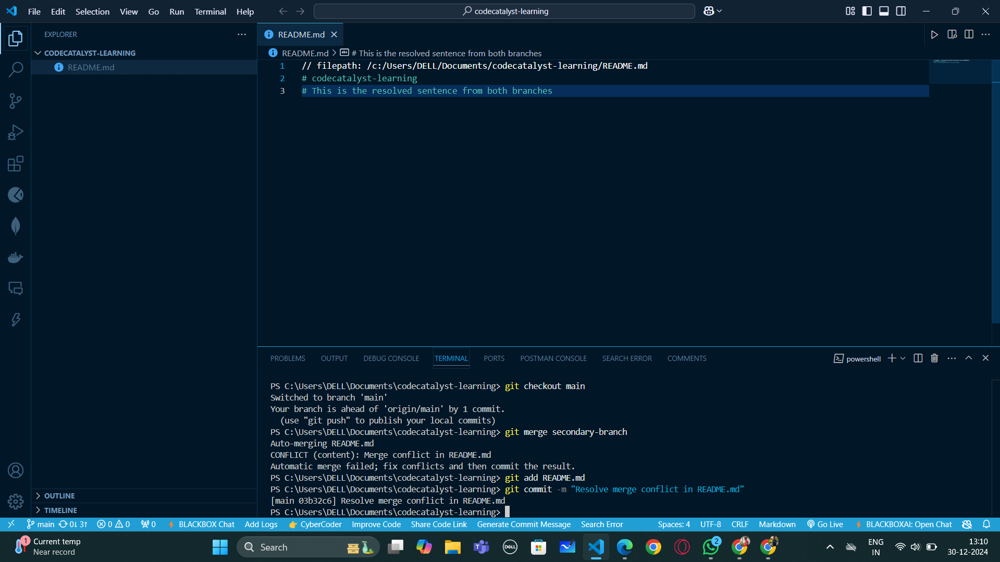

// filepath: /c:/Users/DELL/Documents/codecatalyst-learning/README.md
# codecatalyst-learning
# This is the resolved sentence from both branches

<!-- ...existing content... -->

## Images

<!-- Add more images as needed -->

<!-- ...existing content... -->